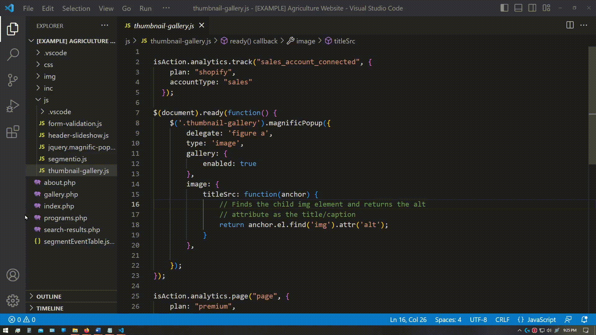
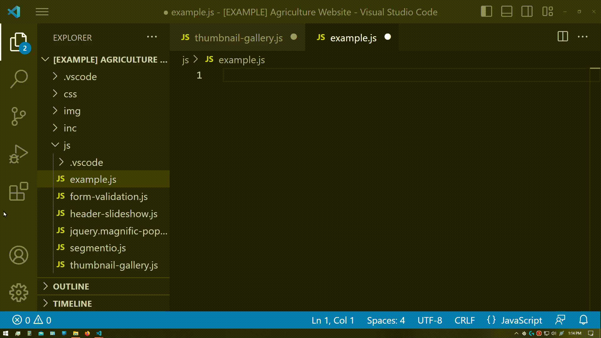
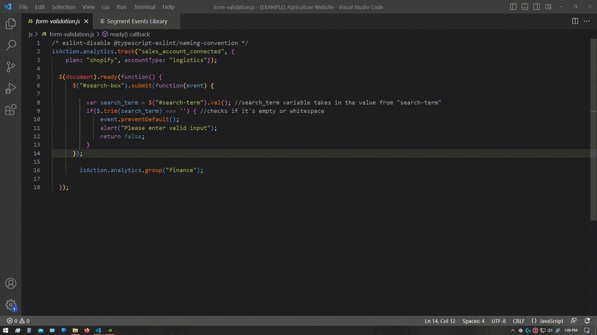
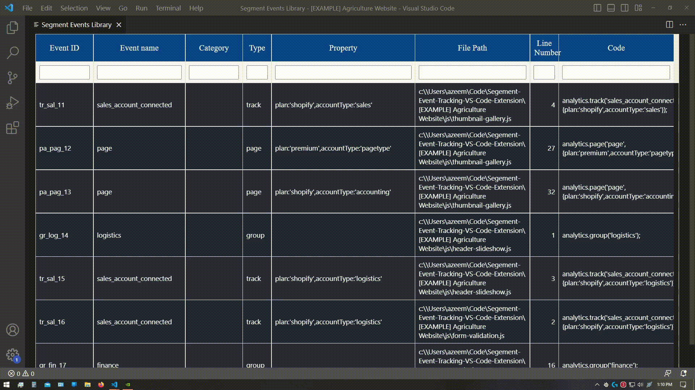
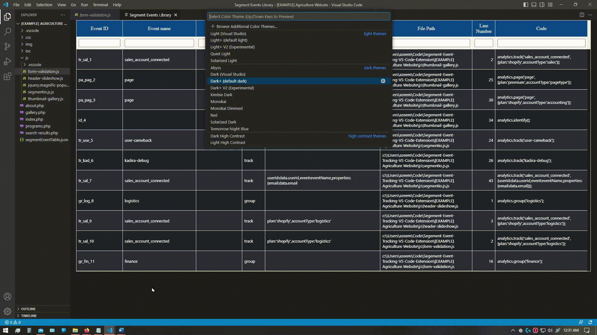

 ##  Who/What is Seca?

Seca is a code assistant that creates a library of existing Segment events in your codebase and makes suggestions of code to reuse your <a href="https://segment.com">Segment code </a>!  

Download the extension from the Visual Studio Code Marketplace!:
https://marketplace.visualstudio.com/items?itemName=seca.segment-event-tracking

### Available Features

1. Extracting Segment Events to a Library ✨! Easily extracts goes through all .js or .jsx files in a workspace and extracts Segment events by <b>Ctrl / ⌘ Cmd key + Shift + P</b> and selecting <b>Segment Tracker: Track Segment Events</b>

2. Code Assistant to make suggestions of existing code so you can simply paste existing code! 🥰

3. Quickly see all of your Segment Evenets along with their attributes in one place and quickly locate them! <b>Ctrl / ⌘ Cmd key + Shift + P</b> and selecting <b>Segment Tracker: Show Segment Table</b> Also you can quickly filter out items in the table (uses substring matching)

4. Double-clicking any row on the table opens the file and line number allowing you to quickly locate the code snippet.

5. Dynamic Theme switching! Based on your IDE theme type, the report table generated will change theme based on type of theme. 

### Seca supports:

1. JavaScript and JavaScript React
2. Segment 3.0
3. Only web development related specs, i.e. Identify, Group, Page, Track (Not included: Alias, Screen)

## Installing Seca:

Download the extension from the Visual Studio Code Marketplace!:
https://marketplace.visualstudio.com/items?itemName=seca.segment-event-tracking

## How to use Seca:

**Step 1)** To track all Segment events - Command/Ctrl + shift + P, then look for Segment: Track Events

After this a snippet file is created where users can easily reuse code. They can simple type in your code the name of the event, type and it will show you all the snippets that match. This command will also create a .json file that stores all Segment events.

**Step 2)** To show Segment Even Table - Command/Ctrl + shift + p, then look for Segment: Show Segment Report

This will open up another tab where a table is generated where users can see at a glance all of the Segment events in their code. Users can search for each field and also double-click each any row and it will open the file and the line that the code is located.

## Before using

1. Make sure you are in a defined Workspace.

2. Extension starts when you run the first command.

3. Every time you add you wish to update your code, you can use just Command/Ctrl + shift + P, then look for "Segment: Track Events to refresh" command to refresh the table

## Support

Link to the documentation:
https://docs.google.com/document/d/e/2PACX-1vRdt-suL7a206GDMYWYrmRglzGmCb8Pb7QS97Xoq7VTZ_uWTuQJCtNJFv0O7V1sqg/pub

If you have any questions, please feel free to contact us through the following medium: 

- eunice.choi@queensu.ca
- azeem.quadri99@gmail.com